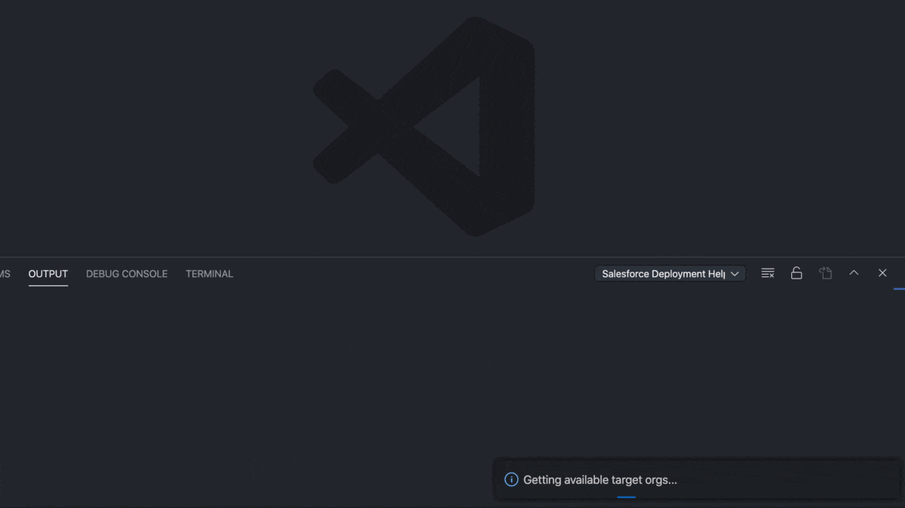

# Salesforce Deployment Helper

Build deployments from a salesforce project and deploy to any org. Requires the [Salesforce Extension Pack](https://marketplace.visualstudio.com/items?itemName=salesforce.salesforcedx-vscode).

## Features

The following commands are included in the extension:

### Add to Deployment

Adds a source file or directory to a deployment.

### Remove From Deployment

Removes a source file or directory from a deployment.

### Deploy to Org

Deploys the selected metadata to a salesforce environment. You'll be prompted to enter a username or alias for the target org. The target org must have been previously authorized using the `SFDX:Authorize an Org` salesforce extension command or via the `sfdx force:auth:web:login` salesforce cli command.

### View Metadata in Deployment

Shows all of the metadata stored in the current deployment.

### Clear Deployment

Removes all metadata in the deployment.

## Requirements

Requires the latest version of the [Salesforce Extension Pack](https://marketplace.visualstudio.com/items?itemName=salesforce.salesforcedx-vscode).

## Known Issues

Calling out known issues can help limit users opening duplicate issues against your extension.

## Release Notes

### 1.0.0

Initial release of the Salesforce Deployment Helper. Includes the following features:

-   Add to deployment
-   Remove from deployment
-   Deploy to org
-   View current deployment
-   Clear current deployment
